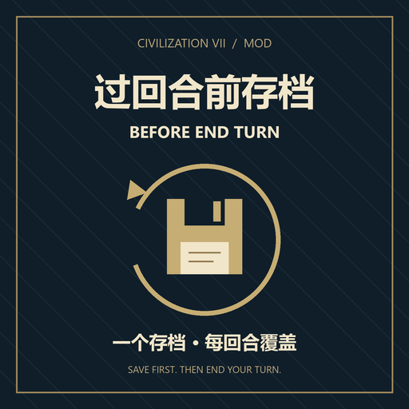

# 过回合前存档 · Before End Turn

版本：1.0.0（首次公开预览版）。面向 Windows《文明 VII》单人游戏。

[Steam 创意工坊订阅](https://steamcommunity.com/sharedfiles/filedetails/?id=3815596737) · [GitHub 源码](https://github.com/Stupidism/civ7-before-end-turn) · [版本下载](https://github.com/Stupidism/civ7-before-end-turn/releases)



点击“下一回合”时，先把**当前回合已经完成的操作**保存到固定的 `BeforeEndTurn` 存档，再推进回合。如果 AI 在过回合时抢了奇观、宣战，载入这个存档就能回到刚才按下“下一回合”之前。

## 使用

1. 完全退出游戏后重新启动。
2. 在主菜单的模组管理中确认 **过回合前存档 · Before End Turn** 已启用。
3. 载入已有单人存档，正常操作并点击“下一回合”。存档过程中会短暂显示“正在保存过回合前的进度…”。
4. 需要反悔时，打开 **载入游戏 → 本地存档**，选择 **BeforeEndTurn**。这是普通本地存档列表中的固定条目。

鼠标按钮、下一操作快捷键、强制结束回合快捷键、手柄下一操作和官方“自动结束回合”均接入当前游戏的 `PanelAction.sendEndTurn`。

这个模组维护 **一个固定存档槽**：每次覆盖同一个 `BeforeEndTurn`，文件名不附加回合、时代或日期。同一台电脑上的不同单人对局也共用这一槽位；需要长久保留某个节点时，请另存一个手动档。

官方自动存档继续遵循你原来的设置。模组的固定槽独立于快速存档，因此 F5 快存和快速载入仍对应官方快速存档，而不是 `BeforeEndTurn`。

## 安装与卸载

本机安装位置：

```text
%LOCALAPPDATA%\Firaxis Games\Sid Meier's Civilization VII\Mods\civ7-before-end-turn\
```

订阅工坊版时，请先退出游戏，把已有手动版文件夹移到 Mods 目录之外，避免同一 Mod 同时加载两份。

重新安装时，把压缩包中的 `civ7-before-end-turn` 文件夹放到上述 `Mods` 目录中。确认目录内直接能看到 `before-end-turn.modinfo`，避免多嵌套一层同名文件夹。

卸载时，在游戏中禁用此模组，或退出游戏后删除这个模组文件夹。已有 `BeforeEndTurn` 普通存档仍可从游戏的载入界面管理。

这是 UI 模组，`AffectsSavedGames=0`，可以用于已有对局。

## 存档失败时

模组等待游戏发出成功的 `SaveComplete` 通知后才真正提交结束回合。存档期间暂时锁住输入，避免保存后又操作了单位、导致备份内容和过回合时的内容不一致。

保存被拒绝、保存报错、检测到并发存档或 60 秒没有完成通知时，会留在当前回合并提示。可选择“重试存档”或“留在本回合”。失败后自动结束回合不会循环重试；手动再次点击“下一回合”可以重新尝试。

如果磁盘已满或游戏的写入过程出错，旧存档是否完整仍取决于游戏本身。模组不会把“请求已发送”当作“文件已保存”。

## 适用范围

- 仅在本地玩家活动回合的单人游戏中执行。多人、热座和 Autoplay 直接沿用游戏流程。
- 当时代已经结束、游戏的 `ContextManager.canSaveGame()` 禁止普通存档时，会提示并保留最近一次有效的 `BeforeEndTurn`，然后允许继续时代转换。触发时代结束之前的那个正常回合已经按相同规则保存。
- 本机“休息一下 · Rest Guard”的加载顺序是 2000，本模组为 1500，因此先完成休息，再保存，再推进回合。已用该模组当前安装版本的控制器代码做模拟集成检查。
- 其他模组若绕过标准 `PanelAction.sendEndTurn`、直接调用原生结束回合接口，可能绕过本模组。直接替换整个行动面板的模组也需要单独验证。
- 游戏更新后，如果过回合入口或原生存档接口变化，需要重新适配。

## 验证情况（2026-10-08）

开发依据是本机正式游戏文件：**1.5.0.44 / 1311346**，Steam build **25516395**。

- JavaScript 语法、modinfo XML 和引用文件检查通过。
- **31 项自动化测试通过，0 项跳过**。发布前已更新集成测试以支持当前 Rest Guard 1.3.0。
- 游戏日志已确认本模组成功初始化；这不等于已验证存档完成。
- 覆盖：保存完成前不得过回合、连续点击去重、固定覆盖槽、等待已有存档、忽略其他种类的存档完成通知、失败与超时、迟到回调、切换对局/时代/玩家后取消旧请求、输入锁定、多人绕过、与 Rest Guard 的调用顺序。
- 集成检查读取本机游戏实际的 `panel-action.js` 与 Rest Guard 代码，使用模拟原生接口执行。
- **尚未在实际游戏进程中验证存档落盘与重新载入。自动化测试不能代替这一步。**

首次验收建议：在一回合内移动一个单位后过回合，检查本地列表中的 `BeforeEndTurn`；载入后应回到刚才那一回合，且单位已经移动。随后再过一回合，确认列表中仍只有一个同名条目且时间更新。完成这次检查后即可确认你当前游戏环境的实际保存行为。

## 开发与排查

无需 npm 安装依赖。源代码目录内运行：

```text
node --test tests/*.test.mjs
```

集成测试默认使用本机 Steam 游戏路径；可通过环境变量 `CIV7_GAME_DIR` 指定其他位置。没有游戏源码的机器会跳过游戏适配测试；独立的状态机测试仍可运行。

日志位于：

```text
%LOCALAPPDATA%\Firaxis Games\Sid Meier's Civilization VII\Logs\UI.log
```

搜索 `[Before End Turn]`。加载成功时有 `Ready`，存档完成并准备推进回合时有 `Saved BeforeEndTurn at turn ...`。模组发现/加载问题可查同目录的 `Modding.log`。

实现依据：游戏自带 `Base/modules/core/ui/save-load/model-save-load.js` 的覆盖保存参数和完成事件；`Base/modules/base-standard/ui/action/panel-action.js` 的过回合入口；`Base/modules/core/ui/context-manager/context-manager.js` 的可保存状态判断。发行包只包含本模组原创代码，测试从本机读取游戏文件。
